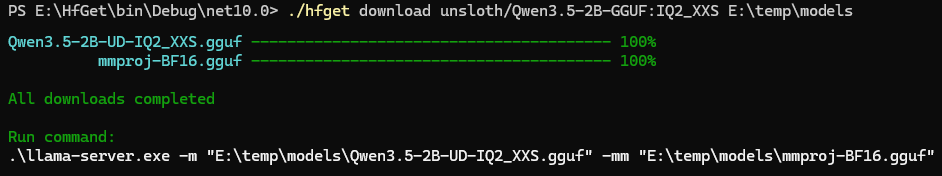
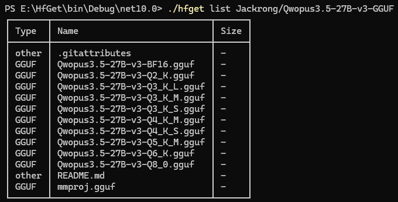

# hfget

Download Hugging Face models (GGUF format) with parallel, resumable downloads.



## Features

- **Parallel downloads** - Download multiple files simultaneously with configurable thread count
- **Resumable downloads** - Automatically resume interrupted downloads
- **GGUF support** - Specifically designed for llama.cpp GGUF models
- **Smart file detection** - Automatically finds matching model and mmproj files
- **Progress tracking** - Real-time progress bars for all downloads
- **Llama.cpp integration** - Outputs ready-to-run llama-server command

## Installation

Download the latest release from the [GitHub releases page](https://github.com/crwsolutions/hfget/releases) or build from source:

```bash
dotnet build
```

## Usage

### Download a model

#### With Default command

```bash
hfget <model> [targetDir]
```

#### Or with explicit command

```bash
hfget download <model> [targetDir]
```

**Aliases:** `get`

**Arguments:**
- `<model>` - Model identifier in format `author/model:variant`
- `[targetDir]` - Destination directory (default: current directory)

**Options:**
- `--token <token>` - Hugging Face API token (for private models)
- `--threads <count>` - Number of parallel download threads (default: 4)

### List model files

```bash
hfget list <model>
```

**Arguments:**
- `<model>` - Model identifier in format `author/model`

**Options:**
- `--token <token>` - Hugging Face API token (for private models)



## Examples

### Download a model to current directory (default)

```bash
hfget download bartowski/Llama-3.2-1B-Instruct-GGUF:q4_k_m
```

This will:
1. Search for a `.gguf` file containing `q4_k_m` in the filename
2. Look for an associated `mmproj` file (for vision models)
3. Download matching files to the current directory
4. Print a command to run with `llama-server.exe`

### Download a model to a specific directory

```bash
hfget download bartowski/Llama-3.2-1B-Instruct-GGUF:q4_k_m ./models
```

### Download with custom thread count

```bash
hfget get "mistralai/Mistral-7B-Instruct-v0.3:q4_k_m" --threads 8 ./models
```

### Download a private model

```bash
hfget download --token hf_XXXXXXXXXX private-user/private-model:q5_k_m
```

### List available files in a model

```bash
hfget list bartowski/Llama-3.2-1B-Instruct-GGUF
```

Output shows all files with their types (GGUF, mmproj, other) and sizes.

After downloading, hfget displays a ready-to-run command:

```
Run command:
.\llama-server.exe -m "./models/model.gguf" -mm "./models/mmproj.gguf"
```

## How It Works

1. **Parse model identifier** - Extracts repository name and variant from input
2. **Fetch file list** - Queries Hugging Face API for repository files
3. **Find matching files** - Searches for `.gguf` files containing the variant and `mmproj` files
4. **Download files** - Downloads files in parallel with progress tracking
5. **Generate command** - Outputs a ready-to-run llama.cpp server command

## License

MIT License - see [LICENSE](LICENSE) file for details.